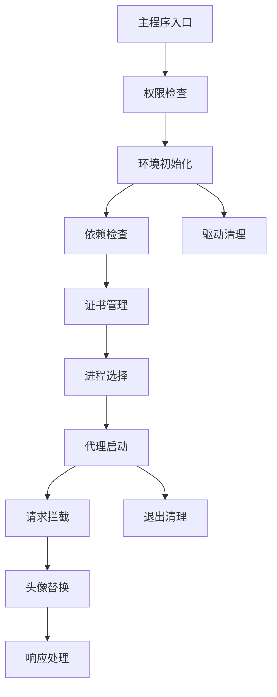

# Custom-UGC-Avatarr 个性化千星奇域头像 
  > [!WARNING]
  > 由于米哈游在月之四版本修改了后端的校验方式，导致该工具在月之四版本已失效无法替换，后续也不会再提供支持，有能力的请自行fork开发。
  > 你可以使用[dx11_tex_dbg_for_mw](https://github.com/VanillaNahida/dx11_tex_dbg_for_mw)这个项目来更换千星奇域头像。
# ⚠警告：禁止使用本项目进行违反国家法律法规的行为。造成的一切后果由使用者承担！
## 感谢 @星渊清梦 提供的思路和代码
~~原作者仓库地址（已删库）：[https://github.com/stardeep925/ugcAvatar](https://github.com/stardeep925/ugcAvatar)~~

注：此文件由ai生成，内容不完全可信

<div align="center">


[](https://github.com/VanillaNahida/Custom-UGC-Avatar/blob/main/LICENSE)
[](https://github.com/VanillaNahida/Custom-UGC-Avatar/stargazers)
[](https://github.com/VanillaNahida/Custom-UGC-Avatar/network)
[](https://github.com/VanillaNahida/Custom-UGC-Avatar/issues)
[](https://www.python.org/)
[](https://www.microsoft.com/windows)

[📦 下载使用](#-快速开始) | [📖 使用文档](#-使用说明) | [💬 问题反馈](https://github.com/VanillaNahida/Custom-UGC-Avatar/issues)

</div>

> UGC Avatar 是一个基于 mitmproxy 的轻量级代理工具，专为原神玩家打造。支持通过本地代理拦截的方式，将自定义头像上传到游戏中，实现个性化头像替换功能。

<details>
<summary>🎯 项目特点</summary>

### 🌟 简单易用
<table>
<tr>
<td>
  
- 一键式操作，无需复杂配置
- 自动管理证书安装与验证
- 智能进程选择，支持列表筛选
- 清晰的中文命令行提示

</td>
</tr>
</table>

### ⚡ 高效稳定
<table>
<tr>
<td>
  
- 基于 mitmproxy 的本地捕获模式
- 智能图片压缩算法，精准匹配目标大小
- 自动生成圆形头像，完美适配游戏UI
- 完善的异常处理和退出清理机制

</td>
</tr>
</table>

### 🔄 智能处理
<table>
<tr>
<td>
  
- 自动识别缩略图与原图请求
- 多种压缩模式自动尝试 (RGBA/调色板)
- PNG 精确填充技术，确保尺寸匹配
- UDP 流量智能过滤，专注 TCP 捕获

</td>
</tr>
</table>

### 🛡️ 安全可靠
<table>
<tr>
<td>
  
- 仅拦截指定进程的网络请求
- 程序退出后自动恢复系统环境
- 清理 WinDivert 驱动残留
- 完善的控制台事件处理

</td>
</tr>
</table>

### 🔌 模块化设计
<table>
<tr>
<td>
  
- 代理环境管理独立模块
- 头像替换逻辑解耦合
- 日志过滤系统可配置
- 扩展性强，易于二次开发

</td>
</tr>
</table>

### 🎨 良好体验
<table>
<tr>
<td>
  
- 详细的请求/响应日志输出
- 实时显示替换状态与结果
- 支持打包为独立 exe 程序
- 兼容多种图片格式输入

</td>
</tr>
</table>

</details>

<details>
<summary>💡 技术亮点</summary>

<table>
<tr>
<td>
  
| 特性 | 描述 |
|------|------|
| 🔄 本地代理模式 | 使用 mitmproxy local mode，直接捕获进程请求 |
| 📦 精准尺寸控制 | PNG tEXt 块填充技术，确保字节级精确匹配 |
| 🚀 多模式压缩 | RGBA/调色板多级压缩，自动选择最优方案 |
| ⚡ 圆形头像生成 | 自动裁剪为圆形，适配游戏 UI 显示 |
| 🔒 环境自动清理 | 程序退出时自动恢复系统网络设置 |
| 🛡️ 驱动管理 | 自动管理 WinDivert 驱动的安装与卸载 |
| 🌐 证书自动化 | 自动生成并安装 mitmproxy 根证书 |

</td>
</tr>
</table>

</details>

<details>
<summary>🔧 技术架构</summary>

<table>
<tr>
<td>
  


- 基于 Python 3.8+ 开发
- 使用 mitmproxy 作为代理核心
- 依赖 Pillow 进行图像处理
- 使用 psutil 进行进程管理
- 支持 PyInstaller 打包

</td>
</tr>
</table>

</details>

## 🚀 快速开始

### 📦下载使用

请前往[Release](https://github.com/VanillaNahida/Custom-UGC-Avatar/releases)页面下载最新版本，解压后运行即可  
使用时请**务必关闭**电脑上的**一切**代理软件和加速器，否则软件会无法成功替换头像

### 📥 安装依赖

<table>
<tr>
<td>

1. 确保已安装 Python 3.8 或更高版本
2. 安装必要依赖：

```bash
pip install mitmproxy>=10.2.0 Pillow psutil
```

3. 可选：安装 Windows 本地捕获支持：

```bash
pip install mitmproxy-windows mitmproxy-rs
```

</td>
</tr>
</table>

### 📝 使用说明

<table>
<tr>
<td>

1. **准备头像图片**
   - 将自定义头像图片放置在桌面
   - 支持 PNG、JPG 等常见图片格式
   - 建议使用正方形图片以获得最佳效果

2. **运行程序**
   - 右键以管理员身份运行 `avatar_proxy.py`
   - 或运行打包后的 `avatar_proxy.exe`

3. **按照提示操作**
   - 输入头像文件名 (如 `tx.png`)
   - 选择目标进程 (默认为 `YuanShen.exe`)

4. **在游戏中操作**
   - 保持程序运行
   - 在游戏中进行头像上传操作
   - 程序会自动拦截并替换头像

5. **查看结果**
   - 控制台会显示 `✓✓✓ 上传成功! ✓✓✓`
   - 按 Ctrl+C 退出程序

</td>
</tr>
</table>

## 🔧 功能模块

<table>
<tr>
<td>

| 模块 | 说明 | 状态 |
|------|------|------|
| 🔐 权限管理 | 自动请求管理员权限提升 | ✅ |
| 🌐 环境管理 | 代理环境初始化与清理 | ✅ |
| 📜 证书管理 | 自动生成、安装和验证证书 | ✅ |
| 📋 进程选择 | 分页式进程列表，支持搜索 | ✅ |
| 🔄 请求拦截 | HTTPS 请求拦截与修改 | ✅ |
| 🖼️ 头像处理 | 图片压缩、裁剪、圆形化 | ✅ |
| 📊 日志系统 | 详细的请求/响应日志 | ✅ |
| 🧹 UDP 过滤 | 过滤 UDP 流量，专注 TCP | ✅ |

</td>
</tr>
</table>

## ⚠️ 注意事项

<table>
<tr>
<td>

- 本工具需要 **管理员权限** 运行
- 首次运行时会自动安装 mitmproxy 根证书
- 确保目标游戏进程正在运行
- 程序退出后会自动恢复系统网络设置
- 仅供学习交流使用，请勿用于非法用途

</td>
</tr>
</table>

## 🤝 参与贡献

<table>
<tr>
<td>

欢迎参与项目贡献！您可以：

- 🐛 提交 [Bug报告](https://github.com/VanillaNahida/Custom-UGC-Avatar/issues/new?template=bug_report.md)
- 💡 提出 [新功能建议](https://github.com/VanillaNahida/Custom-UGC-Avatar/issues/new?template=feature_request.md)
- 📝 改进 [文档](https://github.com/VanillaNahida/Custom-UGC-Avatar/wiki)
- 🔧 提交 [Pull Request](https://github.com/VanillaNahida/Custom-UGC-Avatar/pulls)

</td>
</tr>
</table>

## 📬 交流反馈

<table>
<tr>
<td>

- 📧 问题反馈：[GitHub Issues](https://github.com/VanillaNahida/Custom-UGC-Avatar/issues)

</td>
</tr>
</table>

## 📄 许可证

<table>
<tr>
<td>

本项目采用 [GPL-3.0 license](LICENSE) 许可证。

</td>
</tr>
</table>

---

<div align="center">

**Star History**

[](https://star-history.com/#VanillaNahida/Custom-UGC-Avatar&Date)

Made with ❤️ for Genshin Impact Players

</div>
